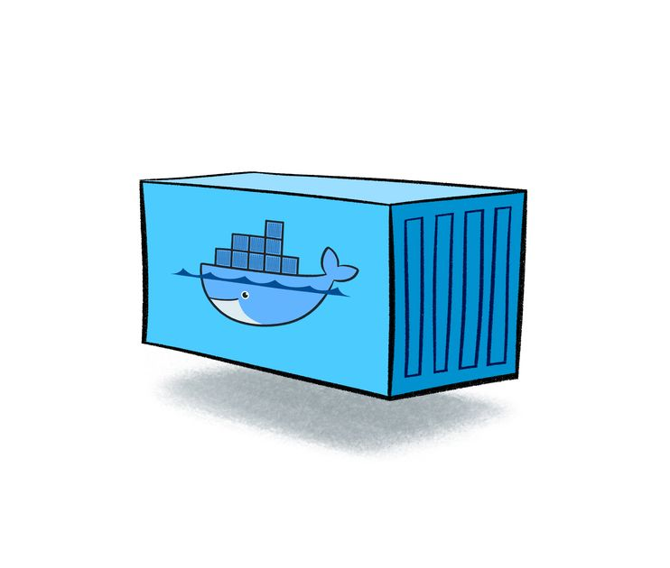

# 📖Docker
#### Kevin, 2023-01-04
---------
## 📝Overview
입사하기 전 부터 회사는 Docker를 써왔었고,
여러 업체에서도 Docker는 마치 업계 표준이 된 것 처럼 많은 서비스에서 사용되고 있는 기술.

MSA (Micro Service Architecture)가 트렌드가 되면서 MSA의 단점 
관리의 복잡성을 해결해주기 위해 서비스의 컨테이너화가 이루어졌고
이 과정에서 Docker와 Kubernetes가 도입이 되었다.
## 가상화를 사용하는 이유
계속해서 발전해 나가는 컴퓨터의 성능을 더욱 효율적으로 사용하기 위해 가상화 기술이 많이 등장했다.

서버 관리자 입장에서는 CPU 점유율이 10%정도 밖에 되지 않는 서버들은 결국 리소스 낭비일 수 밖에 없다.
그렇다고 모든 서비스를 한 서버안에 올리게 되면 안정성 문제가 생길 수 있다, 
그래서 안정성을 높이며 리소스도 최대한 활용할 수 있는 방법으로 나타난 것이 바로 서버 가상화이다.

---------
# Container


컨테이너는 가상화 기술 중  대표이고, LXC(Linux Container)가 있다.
기존 OS를 가상화 시켰던 것과 달리 컨테이너는 OS레벨에서 가상화로 프로세스들을 격리시켜 동작하는 방식.

## VM vs Docker 가상화


VM은 Hypervisor를 이용하여 여러 개의 OS를 하나의 호스트에서 생성하여 사용하는 방식으로
가상화된 하드웨어 위에 OS가 올라가는 형태로 거의 완벽하게 Host와 분리된다. 

컨테이너 기반 가상화는 Docker 엔진 위에 Application 실행에 필요한 Binary만 올라간다.

Hypervisor를 이용한 가상화를 보면 Host OS와 완전히 분리되는 장점은 있지만 OS위에 OS를 올리기 때문에 무겁고 느릴수 밖에 없는 구조다. 

반면 컨테이너 기반 가상화는 Host OS 그리고 Docker 엔진위에서 바로 동작하며 Host OS와 커널을 공유하며
커널을 공유하게 되면 I/O(input/output)처리가 쉽게 되어 성능의 효율을 높일 수 있다.
그리고 하나의 서버에 여러 개의 컨테이너를 실행하면 서로 영향을 미치지 않고 독립적으로 실행할 수 있다.

간략히,
컨테이너를 사용하는 것은 가상머신을 생성하는 것이 아니라 Host OS가 사용하는 자원을 분리하여 여러 환경을 만들 수 있도록 하는 것이다.

---------
# Image
https://www.techtarget.com/searchitoperations/definition/Docker-image

    docker images [OPTIONS] [REPOSITORY[:TAG]]

Doker image는 Docker container 안에서 코드를 실행할 때 사용되는 파일이며 또한, 템플릿처럼 도커 컨테이너를 빌드하는 명령어의 역할을 한다

# Volume & Mount
ref : https://bentist.tistory.com/79

## 1)Mount 
Mount는 물리적인 장치를 특정한 디렉토리에 연결시켜주는 과정

Linux에는 하드디스크의 파티션, CD/DVD, USB메모리 등을 사용하려면 특정한 위치에 연결을 해 줘야 한다.

## 2) Volume
간략히, 도커 엔진이 관리하는 도커 스토리지 directory에 새 directory를 생성하여 컨테이너 내부의 볼륨 데이터를 저장하는 방식.

저장경로는 /var/lib/docker/volumes/~ 에 저장이 된다.

볼륨을 컨테이너에 의존시키면 이 디렉토리가 컨테이너에 탑재되어, 도커에 의해 관리가 되며 Host 시스템 
의 핵심 기능과 분리가 된다,

바인드 마운트가 Host 머신의 디렉토리 구조나 OS에 의존적인 반면, 볼륨은 도커에 의해 완전하게 관리된다.


*출처: https://deveric.tistory.com/111*


```
# volume 조회
docker volume ls
```
```
# volume 생성
docker create volume volume_name
```
```
# volume 삭제
docker volume rm volume_name
```
```
# 사용 안하는 volume 삭제
docker volume prune
``` 

## 3) Bind mount
Bind mount는 도커가 관리하는 디렉토리가 아닌, Host 시스템의 파일이나 디렉토리가 컨테이너에 마운트되며 호스트 시스템의 절대 경로가 참조되는 방식. 
이 방식의 문제는 도커의 관리없이 Host 디렉토리와 마운트를 해서 컨테이너에서 호스트의 파일 시스템에 접근하여 컨테이너에 지정된 파일이 아닌 다른 파일을 삭체하거나 수정할 수 있게 된다. 
그래서 호스트 시스템의 비 Docker 프로세스에 영향을 줄 수 있고 보안에도 영향을 미칠 수 있다. 
따라서 도커 Volume을 사용하는 것을 권장한다.
