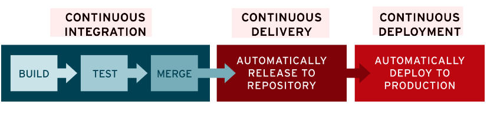
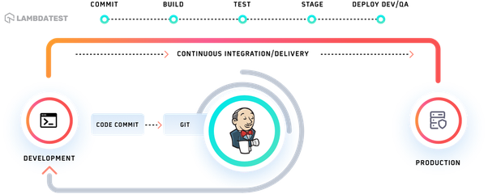

# Study about Jenkins (CI/CD)
### Kevin 2023-01-04
---------
## What is CI / CD
    

#### CI / CD는 Application 개발 단계를 자동화 하여 Application을 더욱 짧은 주기로 고객에게 제공하는 방법이다.

    CI / CD의 기본 개념은 지속적인 통합, 지속적인 서비스 제공, 지속적인 배포이다.
    CI/CD는 새로운 코드 통합으로 인해 개발 및 운영팀에 발생하는 문제 (일명 "통합 지옥(integration hell)")를 해결하기 위한 솔루션.

    

## CI (Continuous Integraion) **지속적인 통합**

#### CI는 간단히 build, test 자동화 과정을 하는 과정.

    CI는 개발자를 위한 자동화 프로세스이다. 
    CI를 성공적으로 구현 할 경우  Application 에 대한 새로운 코드 변경 사항이 정기적으로 
    빌드 및 테스트되어 공유 Repository에 통합되므로 여러 명의 개발자가 동시에 
    Application개발과 관련된 코드 작업을 할 경우 서로 충돌할 수 있는 문제를 해결 해 준다.
    지속적 통합의 실행은 Source/Version 관리 시스템에 대한 
    변경 사항을 정기적으로 Commit하여 모든 사람에게 동일 작업 기반을 제공하는 것으로 시작.
    Commit할 때마다 빌드와 일련의 자동 테스트가 이루어져 동작을 확인하고 변경으로 인해 문제가 생기는 부분이 없도록 보장합니다.
    지속적 통합은 그 자체로 유익하지만, CI / CD Pipeline을 구현하기 위한 첫 번째 단계이기도 함.

## CD (Continuous Delivery, Deployment) 지속적인 서비스 제공, 배포

#### *CD는 간단히 배포 자동화 과정.*

#### CD의 의미
    1. 지속적인 서비스 제공(Continuous Delivery)
    2. 지속적인 배포(Continuous Deployment)
   
#### 이 두 용어가 똑같은 의미는 아닌 상호 교환적으로 사용이 된다.
    두 가지 의미 모두 Pipeline의 추가 단계에 대한 자동화를 뜻하지만, 
    때로는 얼마나 많은 자동화가 이루어지고 있는지를 설명하기 위해 별도로 사용 되는 경우도 있다.

## Jenkins
    모든 언어의 조합과 소스 코드 Repository에 대해 지속적인 통합 (Continuous Integration, CI)과 
    지속적인 배포(Continuous Delivery, CD) 환경을 구축하기 위한 도구이다.
    빌드, 테스트 ,배포 프로세스 등 자동화하여 소프트웨어 품질과 개발 생산성을 높일 수 있다.

#### Jenkins 특징
    1. 프로젝트 표준 컴파일 환경에서의 컴파일 오류 검출
    2. 자동화 테스트 수행 : 코드 분석에 의한 코딩 규약 준수 여부 체크
    3. 프로파일링 툴을 이용한 소스 변경에 따른 성능 변화 감시
    4. 결함 테스트 환경에 대한 배포 작업
    5. 애플리케이션 서버로의 Deploy(배포) 등 간략화

#### 만일 우리가 GitLab Webhook과 같이 사용하게 된다면.

#####  흐름상
     1. 로컬에서 개발 후 깃허브로 커밋 및 푸시
     2. 젠킨스가 이를 인지하여 빌드 및 테스트
     3. 빌드가 성공할 경우 배포 서버로 전송
     4. 빌드가 실패할 경우 로그를 남기고 알림

### Ref
[Jenkins란 무엇이며 왜 사용해야 할까요?](https://jjeongil.tistory.com/810)
[빌드란? 그리고 Jenkins(젠킨스)란? 써야 하는 이유](https://krksap.tistory.com/1377)
[[Jenkins] 젠킨스란 무엇인가](https://ict-nroo.tistory.com/31)

