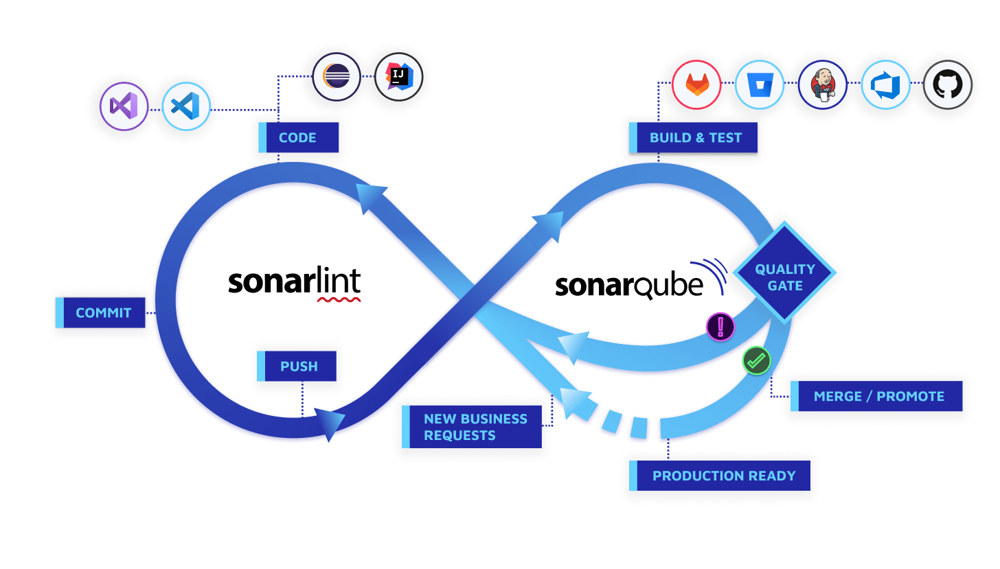

# 📖SonarQube
### Kevin 2023-01-04
> Ref: https://www.notion.so/SonarQube-incomplete-2936bf4119e54fe5aa18990bbcf0848f?pvs=4#6bfbf9452b694b2ea2636c7cbb167020

---

    

### 정적 코드 분석 도구

정적 프로그램 분석 (static program analysis)은 실제 실행 없이 컴퓨터 소프트웨어를 분석하는 것을 말한다. 대부분의 경우, 분석은 소스 코드의 버전 중 하나의 형태로 수행되며, 가끔은 목적 파일 형태로 분석 된다. 이에 반해 실행 중인 프로그램을 분석하는 것을 동적 프로그램 분석이라고 한다.

### 간단하게

정적 분석은 ⇒ 프로그램을 실행하지 않은 상태에서 소스 코드나 컴파일 된 코드를 이용해 프로그램을 분석하는 방법.

동적 분석은 ⇒ 프로그램을 실제 환경이나 가상 환경에서 실행해 보면서 분석하는 방법.

|  | 정적 분석 (Static analysis) | 동적 분석 (Dynamic analysis) |
| --- | --- | --- |
| 분석 대상 | 소스 코드 or 컴파일 된 코드 | 프로그램 실행 환경 |
| 테스트 범위 | 소스 코드의 모든 부분 | 실행 가능한 경로 |
| 활용 | 코드 상의 문제나 실수를 찾음 | 테스트, 모니터 |

### SonarQube

소나큐브 (이전 이름 : 소나 / Sonar)는 **20개 이상의 프로그래밍 언어**에서 **버그**, **코드**, **보안 취약점**을 발견하기 위한 목적으로 정적 **코드 분석**으로 자동 리뷰를 수행하기 위한
지속적인 코드 품질 검사용 오픈 소스 플랫폼이다.

또한 **중복코드**, **코딩 표준**, **유닛 테스트**, **코드 커버리지**, **코드 복잡도**, **주석**, **버그** 및 **보안 취약점**의 보고서를 제공한다.

**그리고 레퍼런스가 많다.**

### 특징

- 지속적인 인스펙션

    지속적인 통합과 같이 빌드와 연동하여 지속적으로 코드에 대한 인스펙션을 수행

- 품질 중앙화

    개발 조직 코드의 품질을 중앙 저장소에서 가시화하고 단일 위치에서 관리한다.

- 품질 요구사항 설정

    품질 게이트를 통해 표준화 된 코드 품질 요구사항을 설정한다.

- 다중 언어 분석

    20개 이상 프로그램 언어에 대한 코드 분석을 지원.

- 플러그인을 통한 확장

    다수의 플로그인을 통해 SonarQube의 기능을 확장할 수 있다.

- 오픈소스 프로젝트

    오픈소스 프로젝트로 특정 범위까지 무료

### 동작구조

    

