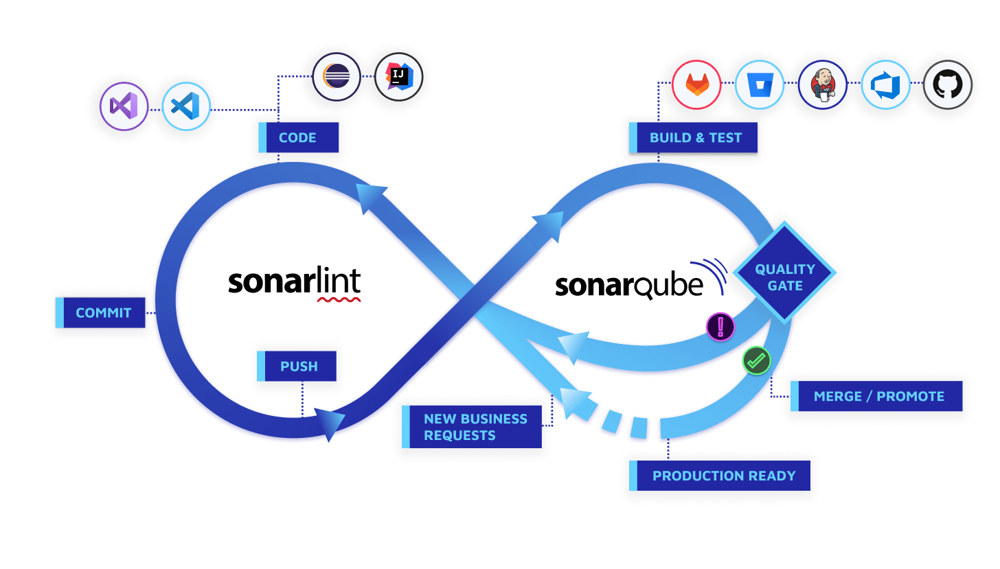
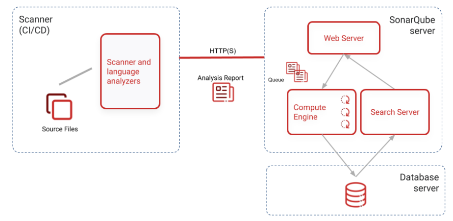

# 📖SonarQube
### Kevin 2023-01-04
Ref: https://docs.sonarqube.org/latest/

---

<p align="center">
    
</p>

### 정적 코드 분석 도구

정적 프로그램 분석 (static program analysis)은 실제 실행 없이 컴퓨터 소프트웨어를 분석하는 것을 말한다. 대부분의 경우, 분석은 소스 코드의 버전 중 하나의 형태로 수행되며, 가끔은 목적 파일 형태로 분석 된다. 이에 반해 실행 중인 프로그램을 분석하는 것을 동적 프로그램 분석이라고 한다.

### 간략히

정적 분석은 ⇒ 프로그램을 실행하지 않은 상태에서 소스 코드나 컴파일 된 코드를 이용해 프로그램을 분석하는 방법.

동적 분석은 ⇒ 프로그램을 실제 환경이나 가상 환경에서 실행해 보면서 분석하는 방법.

|  | 정적 분석 (Static analysis) | 동적 분석 (Dynamic analysis) |
| --- | --- | --- |
| 분석 대상 | 소스 코드 or 컴파일 된 코드 | 프로그램 실행 환경 |
| 테스트 범위 | 소스 코드의 모든 부분 | 실행 가능한 경로 |
| 활용 | 코드 상의 문제나 실수를 찾음 | 테스트, 모니터 |

### SonarQube

소나큐브 (이전 이름 : 소나 / Sonar)는 **20개 이상의 프로그래밍 언어**에서 **버그**, **코드**, **보안 취약점**을 발견하기 위한 목적으로 정적 **코드 분석**으로 자동 리뷰를 수행하기 위한
지속적인 코드 품질 검사용 오픈 소스 플랫폼이다.

또한 **중복코드**, **코딩 표준**, **유닛 테스트**, **코드 커버리지**, **코드 복잡도**, **주석**, **버그** 및 **보안 취약점**의 보고서를 제공한다.

### 특징

- 지속적인 인스펙션

    지속적인 통합과 같이 빌드와 연동하여 지속적으로 코드에 대한 인스펙션을 수행

- 품질 중앙화

    개발 조직 코드의 품질을 중앙 저장소에서 가시화하고 단일 위치에서 관리한다.

- 품질 요구사항 설정

    품질 게이트를 통해 표준화 된 코드 품질 요구사항을 설정한다.

- 다중 언어 분석

    20개 이상 프로그램 언어에 대한 코드 분석을 지원.

- 플러그인을 통한 확장

    다수의 플로그인을 통해 SonarQube의 기능을 확장할 수 있다.

- 오픈소스 프로젝트

    오픈소스 프로젝트로 특정 범위까지 무료

### 동작구조

<p align="center">
    
</p>

크게 Scanner(CI/CD), Server, DB로 구성되어 있다. 각각 많은 리소스를 필요로 하기에 별도의 호스트로 구성하길 권장하고 있으며, 또한 서버와 DB간 네트워크 거리는 최대한 가깝게 구성할 것을 요구하고 있다.


### SonarQube in about of Issues type

#### 1.Code Smells(Maintainability)

심각한 이슈는 아니지만 Best practise에서 사소한 이슈들로 모듈성(modularity), 이해가능성(understandability), 변경가능성(changeability), 테스트용의성(testability), 재사용성(reusability) 등이 포함된다.

- Code Smells
- Debt
- Debt Ratio

#### 2.Bugs(Reliability)

일반적으로 잠재적인 버그 혹은 실행시간에 예상되는 동작을 하지 않는 코드를 나타낸다.

- Code Smells
- Debt
- Debt Ratio

#### 3.Vulnerabilities(Security)

해커들에게 잠재적인 약점이 될 수 있는 보안상의 이슈를 말한다. SQL 인젝션, 크로스 사이트 스크립팅과 같은 보안 취약성을 찾아낸다.

- Code Smells
- Debt
- Debt Ratio

#### 4.Duplications

코드 중복은 코드의 품질을 저해시키는 가장 큰 요인 중 하나이다.

- Density
- Duplicated Lines
- Duplicated Blocks
- Duplicated Files

#### 5.Unit Tests

단위테스트 커버리지를 통해 단위 테스트의 수행 정도와 수행한 테스트의 성공/실패 정보를 제공한다.

Unit Test Coverage

- Line Coverage : 구문 커버리지
- Condition Coverage ; 조건 커버리지

Unit Test Result

- Unit Tests : 단위 테스트 수
- Failures : 실패한 단위테스트 코드 수
- Errors : 에러가 발생한 단위 테스트 코드 수
- Skipped : 스킵한 단위 테스트 코드 수
- Success : 단위 테스트 성공률
- Duration : 단위 테스트 수행에 소요된 시간

#### 6.Complexity

순환복잡도(Cyclomatic Complexity) 측정

- 코드의 논리적인 흐름상에 존재하는 독립적인 선형 경로의 개수를 의미

인지복잡도(Cognitive Complexity)  측정

#### 7.Size

소스코드 사이즈와 관련된 다양한 지표를 제공합니다.

- 코드 라인수
- 전체 라인수
- 구문
- 함수
- 클래스
- 파일
- 디렉토리
- 주석 수
- 코멘트 비율

#### 주요 용어

Continuous Inspection

- 지속적으로 소스 코드를 분석하고 보고 함으로써 품질 트랜드를 파악하고 과거 대비 개선 여부를 파악하고 발생한 이슈를 처리의 반복

Technical Debt

- 최적의 개발 상태를 유지하기 위해서 제거해야 하는 변경 비용의 격차를 의미

Issues

- 소프트웨어 품질을 개선할 수 있는 항목을 이슈라는 최소 단위로 관리

Quality Metric

- 품질에 영향을 미치는 특징을 가진 요소를 의미하며 소프트웨어 품질 특성들을 정량적으로 표시하기 위한 기준

Quality Measure

- 품질에 영향을 미치는 특징을 가진 요소들을 정량적으로 측정한 수치

#### Issue types

1. **Bug**

    런타임에 오류 또는 예기치 않은 동작으로 이어질 수 있는 코딩 실수.

2. **Vulnerability**

    코드에서 공격에 노출된 지점.

3. **Code Smell**

    코드를 혼란스럽고 유지 관리하기 어렵게 만드는 유지 관리 가능성 이슈(Maintainability issue)


#### 이슈 심각도(Issue Severity)

1. **BLOCKER**

    프로덕션 환경에서 애플리케이션의 동작에 영향을 줄 가능성이 높은 버그 **→ 즉시 수정되어야 하는 코드**

    ex*) 메모리 누수(memory leak), JDBC 연결이 닫히지 않음(unclosed JDBC connection) 등*

2. **CRITICAL**

    프로덕션 환경에서 애플리케이션의 동작에 영향을 줄 가능성이 낮은 버그 또는 보안 결함을 나타내는 이슈 **→ 즉시 검토되어야 하는 코드**

    ex*) 빈 캐치 블록(empty catch block), SQL 삽입(SQL injection) 등*

3. **MAJOR**

    개발자 생산성에 큰 영향을 줄 수 있는 품질 결함

    ex*) 코드 조각(uncovered piece of code), 중복 블록(duplicated blocks), 사용하지 않는 매개변수(unused parameters) 등*

4. **MINOR**

    개발자 생산성에 약간 영향을 줄 수 있는 품질 결함 

    ex*) 줄이 너무 길지 않아야 하며 "switch" 문에는 최소 3개의 경우가 있어야 함(lines should not be too long, "switch" statements should have at least 3 cases) 등*

5. **INFO**

    버그도 품질 결함도 아닌 단지 발견한 것

-------

### Docker

**실행 전 확인 할 사항**

``` shell
# max map count 값 확인 (Default 65530)
sudo sysctl vm.max_map_count

# max map count 값 변경
sudo sysctl -w vm.max_map_count=262144
```
Docker에 올라가게 되면 SonarQube의 기본 정보사항은

ID: admin
PASS: admin

로 저장 되어 있다 이 정보로 로그인 시 비밀번호 변경을 요구를 함.

### Jenkins 연동
일단 아무 소스코드로 테스트
